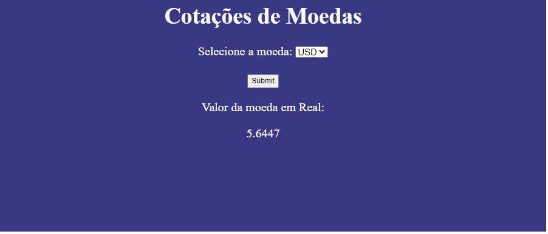
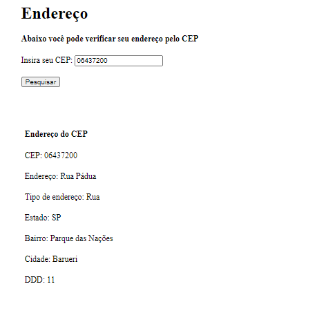

# Práticas e Aprendizados em JavaScript

### Disponibilizado por Codar2

## Meu primeiro formulário

- Objetivo: Criar um formulário com validador em JavaScript para certificar que todos os campos sejam preenchidos e da maneira correta.

## Atividade de API REST:

*Home-Page*:

*register-page*:

## Atividades de prática em Javascript 

#### Atividade 1
- Desenvolver uma aplicação WEB usando HTML5 e Javascript(ES2020), com botões que, ao clicar a cor da página muda(verde-vermelho).

#### Atividade 2
- 01 - Crie uma função que recebe 2 parâmetros e retorna a soma deles.
 
- 02 - Seguindo o que foi feito no exercicio 01, crie uma função que recebe 2 parâmetros e retorna a soma deles, porém caso seja passado um parâmetro vazio ela retorne zero.
 
- 03 - Crie uma função que recebe o ano de nascimento da pessoa informando se ela é maior de idade ou menor.

- 04 - Crie uma função que informa se tem os caracteres 'dota' no parâmetro informado, exiba um alert em tela caso seja verdadeiro.

Ex: 'lol é melhor que dota' (verdadeiro)
Ex: 'lol é melhor que Dark Souls' (falso) / e Falso na vida real tmb.

- 05 -  Peça ao usuário para digitar 5 números em uma caixa de texto. Calcule a média das destes números digitadas pelo usuário e exiba em uma div.

#### Atividade 3

- 01 - Crie o seguinte array: var deuses = ['Odin', 'Loki', 'Thor']
E Exiba a quantidade/comprimento que ele tem com a função .length

- 02 - Com o que foi feito no exercício anterior, exiba todos os nomes, dentro do html: <ul id="nomes"></ul>

- 03 - Seguindo do exercício 02, adicione o .sort para filtrar o array exibido no HTML. alfabeticamente  

- 04 - Exiba a quantidade de letras que possuem o texto inserido ao clicar no botão.

Exemplos de entrada e saída:
'Caio' // 4
'Felipe' // 6
'Roberto' // 7
'Tiago' // 5

*EXTRA: adicione CSS nos exercícios para melhor exibição dos resultado*

#### Atividade 4
- 01- Dentro da div com o id 'resultado', escreva 1x ('Repetição'). dica: 'innerHTML', el.innerHTML = 'Repetição';

1.1 - Dentro da div com o id 'resultado', escreva 2x ('Repetição').
1.2 - Dentro da div com o id 'resultado', escreva 20x ('Repetição'). (use o 'for')
1.3 - Dentro da div com o id 'resultado', escreva 5x ('Repetição'). (agora com forEach)
1.3 - Dentro da div com o id 'resultado', escreva 5x ('Repetição'). (agora com while)
- 02 - Dentro da div com o id 'resultado', escreva os números de 0 ~ 10 (escolha uma das opções utilizado no exercício anterior)
- 03 - Dentro da div com o id 'resultado', escreva os números pares até 20... (ex 2,4,6...20)

- 04 - A partir do seguinte vetor e utilizando os métodos de array (map, reduce, filter e find):
const usuarios = [
 { nome: 'Caio', idade: 25, empresa: 'Google' },
 { nome: 'Tiago', idade: 35, empresa: 'Microsoft' },
 { nome: 'Felipe', idade: 30, empresa: 'Apple' },
];

4.1- Utilizando o map
Crie uma variável que contenha todas idades dos usuários: [23, 15, 30]

4.2- Utilizando o filter
Crie uma variáveis que tenha apenas os usuários que trabalham na Apple e idade maior ou igual a 30 anos: [{ nome: 'Felipe', idade: 30, empresa: 'Apple' }}];

4.3- Utilizando o find
Crie uma variável que procura por um usuário que trabalhe na empresa Google.

#### Atividade 5
Projeto 01

Desenvolva um conversor de moedas utilizando o  XMLHttpRequest(AJAX) para requisições em JS.

#### Atividade 6
Neste projeto você precisará construir uma tela para pesquisa de CEP, que no momento que o cliente inserir o CEP dele deverá retornar o seu endereço completo.
O layout foi escolhido pelo cliente.

### Obrigado por chegar até aqui
